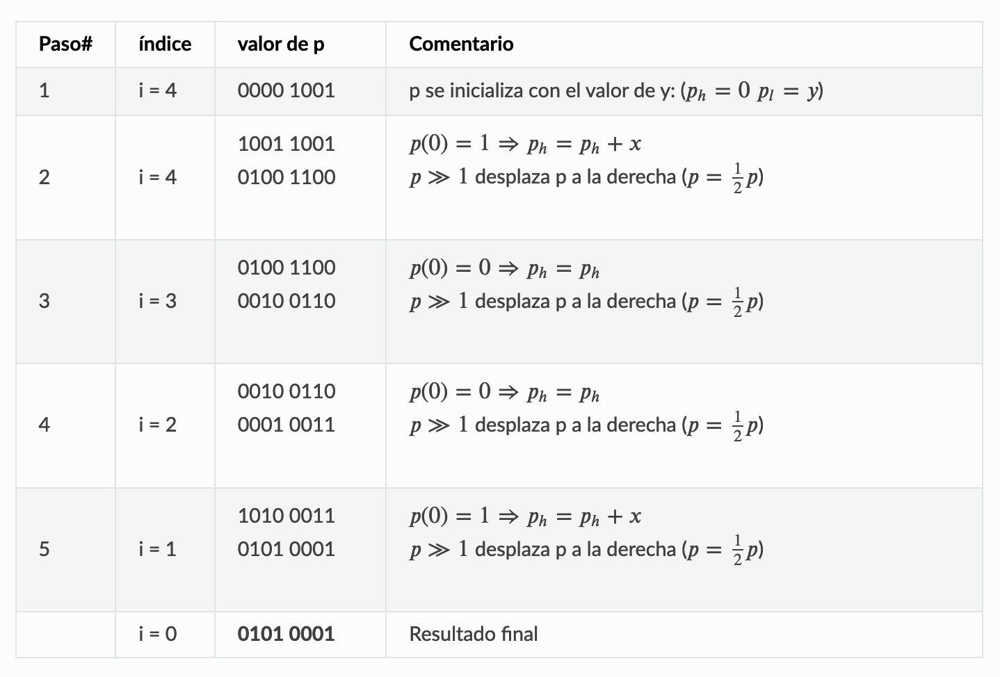

<!-- HEADERS -->
<h1 align="center">
  <b> 
    Multiplicador serie
  </b>
</h1>

- [🎯 Objetivos](#🎯-objetivos)
- [✖️ Proceso de la multiplicación](#🔢-proceso-de-la-multiplicación)
- [📓 Definición del data-path](#📓-definición-del-data-path)
  - [🔢 Contador](#🔢-contador)
- [🕹️ Definición de la unidad de control](#🕹️-definición-de-la-unidad-de-control)
- [🔲 Esquema general del multiplicador](#🔲-esquema-general-del-multiplicador)
- [📟 Simulación en Quartus](#📟-simulación-en-quartus)

&nbsp;

# 🎯 Objetivos
El objetivo general de este proyecto es la realización de un multiplicador serie e implementarlo en la tarjeta DE10-Lite. El multiplicador tomará dos datos de 4 bits (X e Y) y los multiplicará.

&nbsp;

# ✖️ Proceso de la multiplicación
El resultado estará formado por una "parte alta" y una "parte baja" de 4 bits, la unión de ambas partes será el número final. Para llegar a dicho valor, se emplea el siguiente algoritmo:
- Al iniciar la operación, a la parte alta se le asigna 0 y a la parte baja el valor de Y.
- Si el bit menos significativo de la parte baja es 0, se realiza un desplazamiento a la derecha de la parte alta añadiendo un 0 al principio, quedando al final un número de 5 bits.
- En caso contrario, se realiza la misma operación, pero a la parte alta se le suma el valor de X.
- Este algoritmo hay que hacerlo un total de 4 veces (sin contar la inicialización).

> Estas operaciones son realizadas por la **ALU**

&nbsp;

# 📓 Definición del data-path
El circuito para implementar esas operaciones estará formado por 2 registros que almacenen X y el resultado final, la unidad aritmético lógica y 2 multiplexores que unirán parte alta y baja, formando el siguiente diagrama de bloques.

&nbsp;

## 🔢 Contador
¿Y cómo controlamos los pasos que tiene que hacer el data-path? El final de la multiplicación se maneja mediante una señal de salida *done* que se pone a 1 cuando acaba. En la [descripición VHDL](https://github.com/jorgeloopzz/Multipliier/blob/main/quartus/multiplier_datapath.vhd) hay que añadir un contador no mostrado en la imagen

&nbsp;

# 🕹️ Definición de la unidad de control

&nbsp;

# 🔲 Esquema general del multiplicador

&nbsp;

# 📟 Simulación en Quartus

&nbsp;

  
  
  

